<div align="center">

# EdgeVAD: Edge AI for Real-World Video Anomaly Detection

[Kahlil Muchtar (Universitas Syiah Kuala, COMVISLAB USK)](https://comvis.mystrikingly.com/), Al Bahri (Universitas Syiah Kuala), Yudha Nurdin (Universitas Syiah Kuala), [Oky Firmansyah (Nodeflux)](https://www.nodeflux.io/), Alvin Prayuda Juniarta Dwiyantoro (Google), and [Martha Arbayani Zaidan (University of Helsinki)](https://www.marthazaidan.com/) <br><br>

</div>

<div align="justify">

> **_Abstract:_** _The growing implementation of Intelligent Surveillance Systems (ISS) has heightened the need for Video Anomaly Detection (VAD) to enhance security, reduce labor costs, and improve energy efficiency. Most current VAD methodologies concentrate on delivering superior outcomes based on quantitative metrics, including multimodal techniques, LLM-based models, vision transformers, and sort on. However, these techniques typically demand substantial computational power and are limited to offline operations, rendering them unsuitable for online or real-time VAD surveillance applications. This paper introduces a VAD system based on Edge AI, which integrates a lightweight S3D-based extractor utilizing the Gaussian Error Linear Unit (GeLU) activation function, resulting in an enhanced VAD system. We conduct a comprehensive analysis of the performance of our proposed solution on two well-known edge devices: the Jetson Orin Nano and the ASUS NUC Performance. The analysis encompasses inference speeds, power consumption, and GPU loads across various edge devices. In terms of dataset evaluations, three benchmark datasets (UCF-Crime, XD-Violence, and MSAD) are assessed, demonstrating that our proposed work can attain 86 %, 91%, and 88% of AUC, respectively. These comprehensive insights into the advantages and drawbacks of different edge devices can inform future research and progress in Edge AI technology._

</div><br>

<p align="center">
  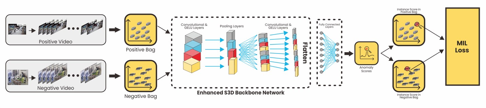
</p>

<small>_Fig. 1. Our proposed EdgeVAD workflow_</small>
<br><br>

<p align="center">
  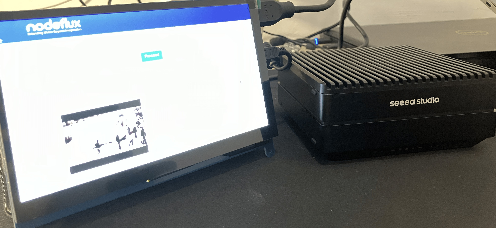<br>
  <small><em>(a)</em></small>
</p>

<p align="center">
  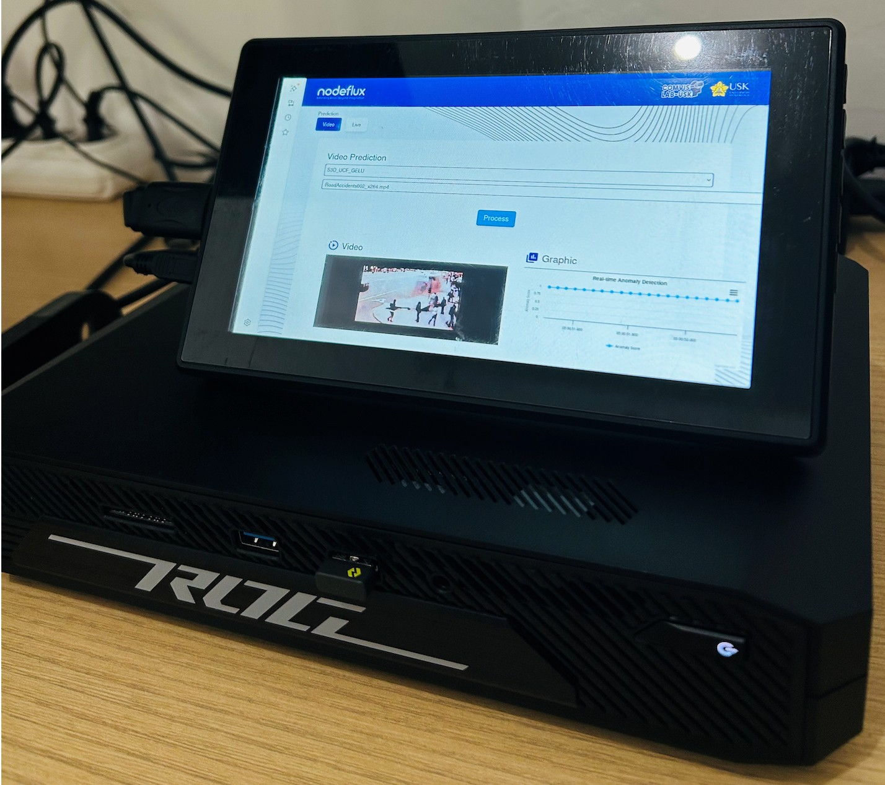<br>
  <small><em>(b)</em></small>
</p>

<small>_Fig. 2. Physical setting of EdgeVAD in Jetson Orin Nano (a) and ASUS NUC Performance (b)._ </small>
<br>
<br>

<p align="center">
  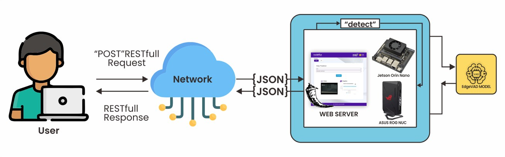
</p>

<small>_Fig. 3. Proposed Web-Interface Setting of EdgeVAD_ </small><br><br>

## 📊 Data

Please download the data, including S3D-GELU features on UCF-Crime, XD-Violence, MSAD datasets, trained model, and sample videos and corresponding features:

- **S3D-GELU UCF-Crime Features:**  
  [🔗 Google Drive Link](https://drive.google.com/drive/folders/1tl_GA9ecUq_Zo8FejsmaXmGGq6a1evMP?usp=sharing)

- **S3D-GELU XD-Violence Features:**  
  [🔗 Google Drive Link](https://drive.google.com/drive/folders/13OV2U2SynknxK-RJQX4tqtb81togead_?usp=sharing)

- **S3D-GELU MSAD Features:**  
  [🔗 Google Drive Link](https://drive.google.com/drive/folders/1SzMTWWPZ3S9mWE_snSdrw8bsDJyIyZnY?usp=sharing)
  <br>
  <br>

## 📦 Trained Models

- **UCF-Crime:**  
  [🔗 Google Drive Link](https://drive.google.com/file/d/1nDiF4sjv7V1SzHCkEARAHi-75wMbR0sr/view?usp=sharing)

- **XD-Violence:**  
  [🔗 Google Drive Link](https://drive.google.com/file/d/19BvfxD-ZTnZbWWmNkfN4M-SJKHOozhMi/view?usp=sharing)

- **MSAD:**  
  [🔗 Google Drive Link](https://drive.google.com/file/d/1WlL6RK8XP7JxhjIiVNM4rG-v1LXvELSr/view?usp=sharing)

- **Link of sample videos and corresponding features:**  
  [🔗 Google Drive Link](https://drive.google.com/drive/folders/1O7CT4UHjR1HiAlMuzjhmpYHjQOJu7j4O?usp=sharing)
  <br>
  <br>

## 📈 Results

- **Results on UCF-Crime**

<p align="center"><b>Table 1. The results of UCF-Crime</b></p>
<div align="center">
  <small>
    <table >
        <tr style="background-color:#b3b3b3; text-align:center;">
            <th>Supervision</th>
            <th>Method</th>
            <th>Backbone</th>
            <th>AUC</th>
        </tr>
        <tr>
            <td rowspan="10" style="background-color:#b3b3b3; font-weight:bold; text-align:center;">
            Weakly supervised
            </td>
            <td>Sulthani et al. [23]</td>
            <td>C3D RGB</td>
            <td>75.41</td>
        </tr>
        <tr>
            <td>Zhang et al. [53]</td>
            <td>C3D RGB</td>
            <td>78.66</td>
        </tr>
        <tr>
            <td>Motion-Aware [54]</td>
            <td>PWC-Flow</td>
            <td>79.00</td>
        </tr>
        <tr>
            <td>GCN-Anomaly [37]</td>
            <td>TSN-RGB</td>
            <td>82.12</td>
        </tr>
        <tr>
            <td>CLAWS Net [55]</td>
            <td>C3D RGB</td>
            <td>83.03</td>
        </tr>
        <tr>
            <td>CLAWS Net+ [56]</td>
            <td>C3D RGB</td>
            <td>83.37</td>
        </tr>
        <tr>
            <td>CLAWS Net+ [56]</td>
            <td>3DResNext</td>
            <td>84.16</td>
        </tr>
        <tr>
            <td>Wu et al. [16]</td>
            <td>I3D</td>
            <td>82.44</td>
        </tr>
        <tr>
            <td>RTFM [36]</td>
            <td>C3D</td>
            <td>83.28</td>
        </tr>
        <tr>
            <td>RTFM [36]</td>
            <td>I3D</td>
            <td>84.30</td>
        </tr>
        <tr>
            <td rowspan="6" style="background-color:#b3b3b3; font-weight:bold; text-align:center;">
            Lightweight Models
            </td>
            <td>Contrastive [50]</td>
            <td>C3D</td>
            <td>83.40</td>
        </tr>
        <tr>
            <td>Contrastive [50]</td>
            <td>I3D</td>
            <td>84.62</td>
        </tr>
        <tr>
            <td>Watanabe [27]</td>
            <td>I3D</td>
            <td>84.91</td>
        </tr>
        <tr>
            <td>BE-WSVAD [57]</td>
            <td>I3D</td>
            <td>84.1</td>
        </tr>
        <tr>
            <td>Wang et al. [28]</td>
            <td>I3D</td>
            <td>84.7</td>
        </tr>
        <tr>
            <td>STVAD [5]</td>
            <td>I3D</td>
            <td>84.98</td>
        </tr>
        <tr style="font-weight:bold;">
            <td></td>
            <td>Ours</td>
            <td>S3D</td>
            <td style="color:red;">86.0</td>
        </tr>
    </table>
  </small>
</div>
<br>

- **Results XD-Violence**

<p align="center"><b>Table 2. The results of XD-Violence</b></p>
<div align="center">
  <small>
    <table >
        <tr style="background-color:#b3b3b3; text-align:center;">
            <th>Supervision</th>
            <th>Method</th>
            <th>Backbone</th>
            <th>AUC</th>
        </tr>
        <tr>
            <td rowspan="11" style="background-color:#b3b3b3; font-weight:bold; text-align:center;">
            Weakly supervised
            </td>
            <td>Sulthani et al. [23]</td>
            <td>C3D RGB</td>
            <td>73.20</td>
        </tr>
        <tr>
            <td>Wu et al. [58]</td>
            <td>I3D</td>
            <td>75.4</td>
        </tr>
        <tr>
            <td>RTFM [13]</td>
            <td>C3D</td>
            <td>75.9</td>
        </tr>
        <tr>
            <td>RTFM [13]</td>
            <td>I3D</td>
            <td>77.8</td>
        </tr>
        <tr>
            <td>Li et al. [38]</td>
            <td>C3D RGB</td>
            <td>75.53</td>
        </tr>
        <tr>
            <td>Li et al. [38]</td>
            <td>I3D RGB</td>
            <td>78.28</td>
        </tr>
        <tr>
            <td>Liu et al. [59]</td>
            <td>I3D RGB</td>
            <td>78.94</td>
        </tr>
        <tr>
            <td>MFGN [60]</td>
            <td>I3D RGB</td>
            <td>79.2</td>
        </tr>
        <tr>
            <td>Distill [61]</td>
            <td>I3D RGB</td>
            <td>79.0</td>
        </tr>
        <tr>
            <td>Park et al. [62]</td>
            <td>I3D RGB</td>
            <td>78.5</td>
        </tr>
        <tr>
            <td>Zhang et al. [63]</td>
            <td>I3D RGB</td>
            <td>78.7</td>
        </tr>
        <tr>
            <td rowspan="2" style="background-color:#b3b3b3; font-weight:bold; text-align:center;">
            Lightweight Models
            </td>
            <td>Contrastive [50]</td>
            <td>I3D+FLOW</td>
            <td>71.5</td>
        </tr>
        <tr>
            <td>STVAD [5]</td>
            <td>I3D RGB</td>
            <td>74.05</td>
        </tr>
        <tr style="font-weight:bold;">
            <td></td>
            <td>Ours</td>
            <td>S3D</td>
            <td style="color:red;">91.0</td>
        </tr>
    </table>
  </small>
</div>
<br>

- **Results on MSAD**

<p align="center"><b>Table 5. The results of MSAD</b></p>
<div align="center">
  <small>
    <table >
        <tr style="background-color:#b3b3b3; text-align:center;">
            <th>Method</th>
            <th>Backbone</th>
            <th>AUC</th>
        </tr>
        <tr>
            <td>
            RTFM [13]
            </td>
            <td>I3D</td>
            <td>86.65</td>
        </tr>
        <tr>
            <td>UR-DMU [64]</td>
            <td>I3D</td>
            <td>85.02</td>
        </tr>
        <tr>
            <td >MGFN [60]</td>
            <td>I3D</td>
            <td>84.96</td>
        </tr>
        <tr>
            <td >TEVAD [65]</td>
            <td>I3D</td>
            <td>86.82</td>
        </tr>
        </tr>
        <tr style="font-weight:bold;">
            <td>Ours</td>
            <td>S3D</td>
            <td style="color:red;">88.0</td>
        </tr>
    </table>
  </small>
</div>
<br>
<br>

## 🎨 Qualitative Results

<p align="center">
    &nbsp;&nbsp;
    
</p>

<p align="center">
    
</p>
<br>

- **Inference Speed between Different Devices**

<p align="center">
  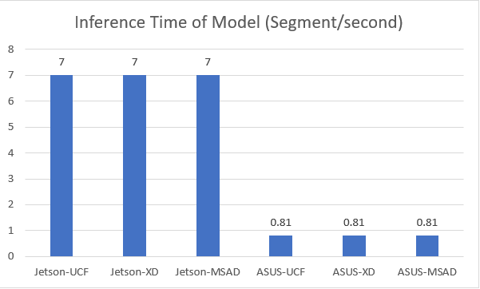
</p>

<small>_Fig. 5. The Inference Comparison between Jetson Orin Nano and ASUS NUC Performance in each dataset model._ </small><br>

- **Power Consumption**

<p align="center">
  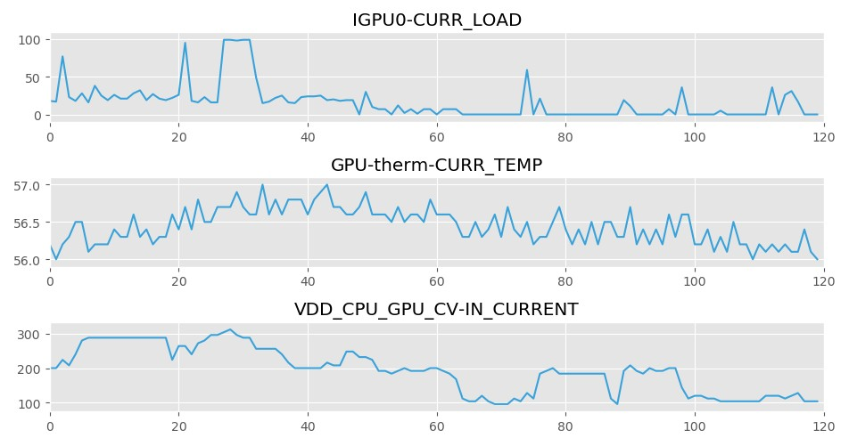<br>
  <small><em>(a)</em></small>
</p>

<p align="center">
  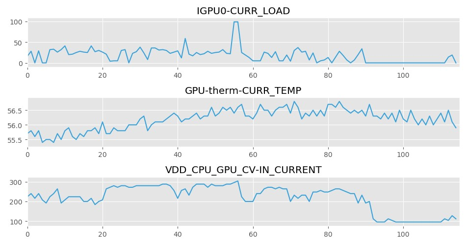<br>
  <small><em>(b)</em></small>
</p>
<p align="center">
  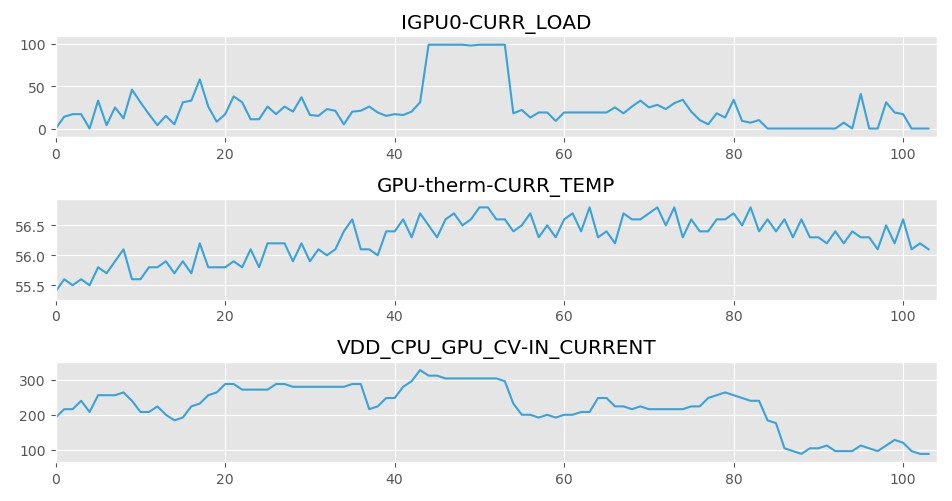<br>
  <small><em>(c)</em></small>
</p>

<small>_Fig. 6. The comparison of GPU load (IGPU0-CURR_LOAD) and temperature (GPU-therm-CURR_TEMP) across the dataset models. (a) UCF-Crime model, (b) XD-Violence model, and (c) MSAD model._ </small>
<br>

<p align="center"><b>Table 2. The results of XD-Violence</b></p>
<div align="center">
  <small>
    <table >
        <tr style="background-color:#b3b3b3; text-align:center;">
            <th>Dataset Model</th>
            <th>Power Usage</th>
            <th>Memory Consumption</th>
            <th>Peak Temperature</th>
        </tr>
        <tr>
            <td style="background-color:#b3b3b3; font-weight:bold; text-align:center;">
            UCF-CRIME
            </td>
            <td>27W / 115W</td>
            <td>1,759 MiB </td>
            <td>~50 °C</td>
        </tr>
        <tr>
            <td style="background-color:#b3b3b3; font-weight:bold; text-align:center;">
            XD-Violence
            <td>27W / 115W</td>
            <td>1,805 MiB </td>
            <td>~50 °C</td>
        </tr>
        <tr>
            <td style="background-color:#b3b3b3; font-weight:bold; text-align:center;">
            MSAD
            <td>26W / 115W</td>
            <td>1,792 MiB </td>
            <td>~50 °C</td>
        </tr>
    </table>
  </small>
</div>
<br>
<br>

## 📝 Citation

Please consider citing our paper in your publications if the project helps your research.

```
“EdgeVAD: Edge AI for Real-World Video Anomaly Detection”, submitted to OJSP, 2026.
```

<!-- <br>
<br>

<div align="center" style="position: relative; width: 100%;">
  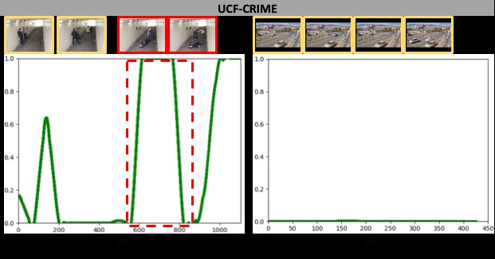
  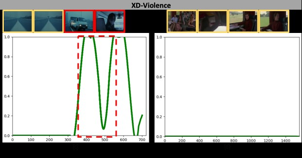
  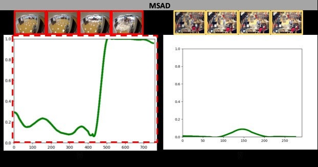
  <div style="
    position: absolute;
    font-style: italic;
    font-size: 14px;
    background: rgba(255,255,255,0.7);
  ">
    Fig. 4. Qualitative analysis of tested videos. The red dotted box shows ground truth values, the green curve indicates the anomaly score, the red box frames show anomaly events, and the yellow box frames indicate normal events. (a) Fighting033, (b) Normal006, (c) Young.And.Dangerous.I.1996 (B6 – Car Accident), (d) Before.Sunrise (Normal), (e) Water Incident – 4, and (f) Normal Testing -7.
  </div>
</div> -->
